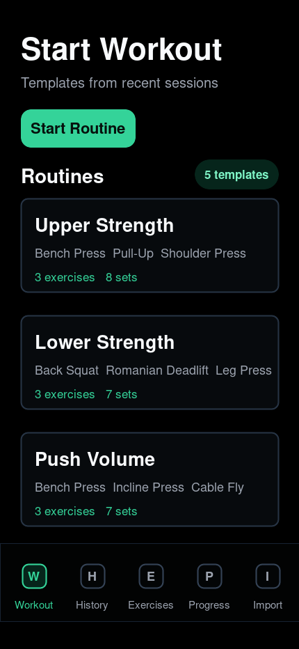
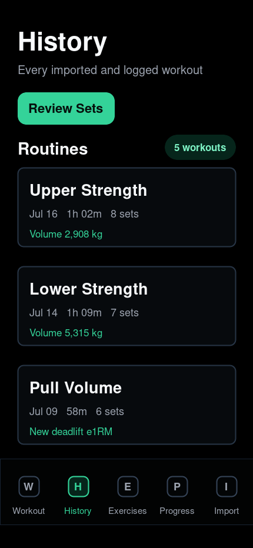
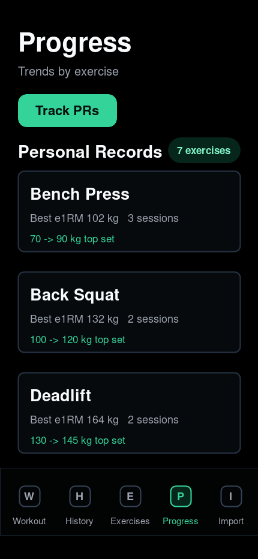

# GymTrack

Local-first workout tracking for lifters who want a fast log, useful progress views, and ownership of their data.

GymTrack runs as a small web app wrapped with Capacitor for Android. It imports workout CSV files, stores data on your device, and lets you export JSON backups whenever you want.

<p align="center">
  
  
  
</p>

## Why GymTrack

- Local-first: no account, ads, analytics, or server sync.
- Import workout CSV files and GymTrack JSON backups.
- Start empty workouts or reuse recent routines.
- Track live workout duration and recovery timers.
- Browse history, exercise trends, volume, best weights, and estimated 1RM.
- Create custom exercises.
- Export your data as JSON.

## Android

Install Node.js, a JDK, and the Android SDK command-line tools.

```bash
npm ci
npm run android:debug
```

Debug APK:

```text
android/app/build/outputs/apk/debug/app-debug.apk
```

Install on a connected Android device:

```bash
npm run android:install
```

Build an unsigned release APK:

```bash
npm run android:release
```

## Web Preview

```bash
python3 -m http.server 5173
```

Then open `http://localhost:5173`.

## F-Droid

GymTrack is being prepared for F-Droid. Submission notes and a starter metadata recipe live in [docs/fdroid-readiness.md](docs/fdroid-readiness.md).

## Privacy

Workout data stays on the device unless you export or share it yourself. See [docs/privacy-policy.md](docs/privacy-policy.md).

## Built With Codex

GymTrack has been developed with OpenAI Codex as an AI coding partner. Codex helped with implementation, Android packaging, F-Droid preparation, cleanup, and documentation. Human review and release decisions remain part of the process.

## License

ISC. See [LICENSE](LICENSE).
